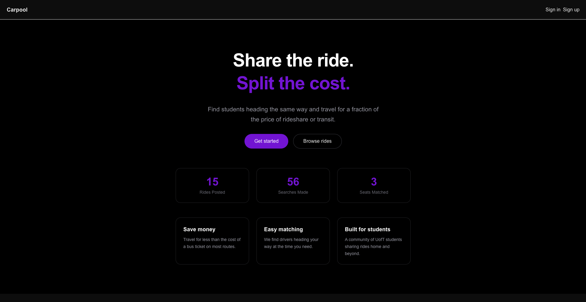
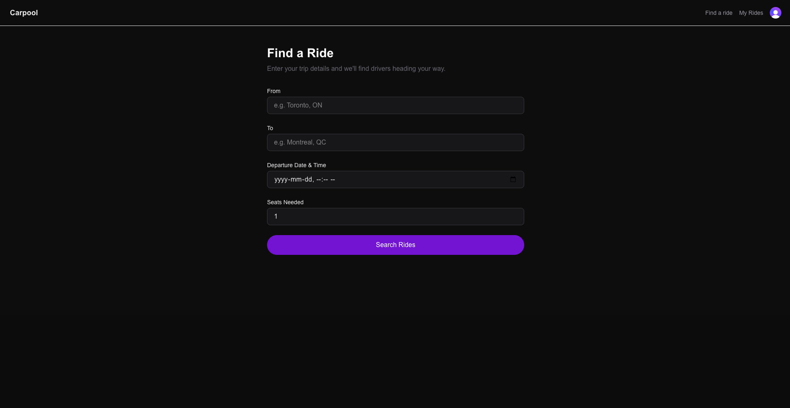
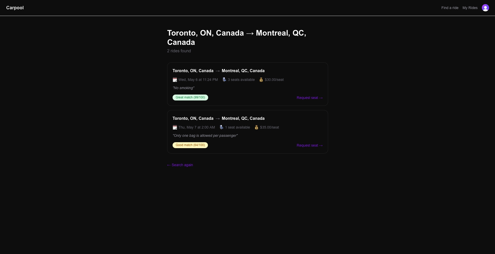
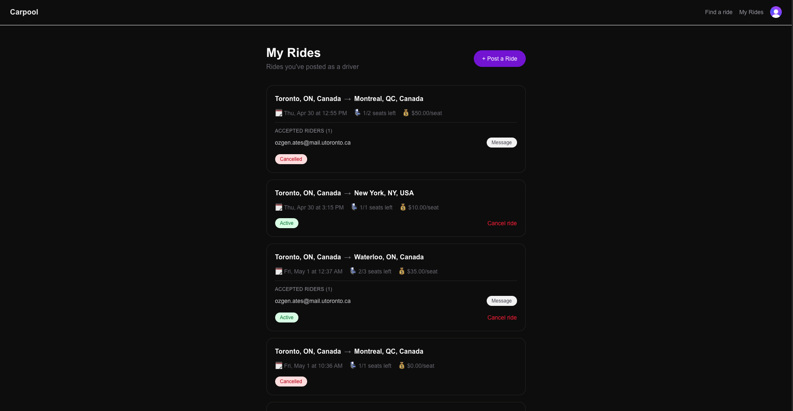
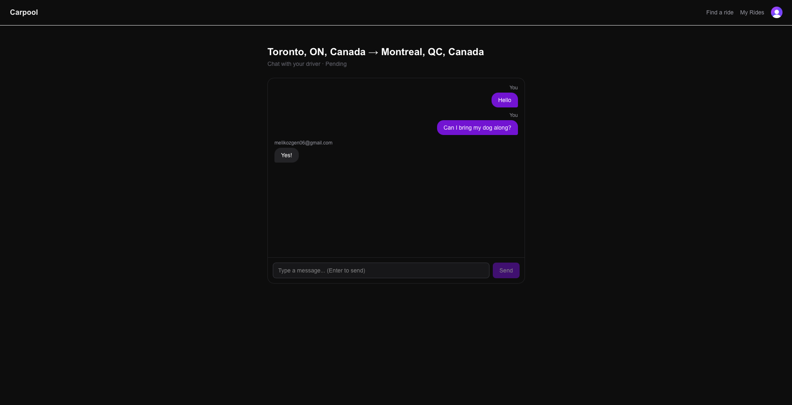

# Carpool

A full-stack carpool matching platform built for students to share rides and split travel costs. Drivers post rides, riders search and request seats, and a custom matching algorithm ranks results by route and time proximity.

**Live demo:** [carpool-app-one.vercel.app](https://carpool-app-one.vercel.app)

---

## Features

- **Ride posting** — Drivers post trips with origin, destination, departure time, seats, and price using Google Places autocomplete for accurate geocoding
- **Smart matching** — A custom Haversine-based scoring algorithm ranks rides by geographic proximity and time match (distance score 50%, time score 40%, freshness 10%)
- **Seat requests** — Riders request seats on matched rides; drivers accept or decline
- **In-app messaging** — Drivers and riders communicate via a per-request message thread with polling-based real-time updates
- **Auth** — Email and Google sign-in via Clerk with webhook-based database sync
- **Stats** — Live ride counts, search counts, and matched seats displayed on the landing page

---

## Tech Stack

| Layer      | Technology                          |
| ---------- | ----------------------------------- |
| Framework  | Next.js 16 (App Router, TypeScript) |
| Styling    | Tailwind CSS                        |
| Auth       | Clerk                               |
| Database   | PostgreSQL (Neon)                   |
| ORM        | Prisma                              |
| Geocoding  | Google Places API                   |
| Deployment | Vercel                              |

---

## Architecture

### Matching Algorithm

The core of the app is a two-step ride matching system in `src/lib/matching.ts`:

**Step 1 — SQL bounding box filter**
Rides are filtered in Postgres using a ±0.5 degree (~55km) lat/lng bounding box around the rider's origin and destination, combined with a ±12 hour departure time window. This narrows the candidate pool efficiently before any expensive computation.

**Step 2 — Haversine scoring**
Each candidate is scored out of 100 using the Haversine formula (great-circle distance) to calculate detour from the rider's desired route:

```
score = (distance_score × 0.5) + (time_score × 0.4) + (freshness_score × 0.1)

distance_score = max(0, 100 - total_detour_km × 5)
time_score     = max(0, 100 - time_diff_minutes / 1.8)
freshness_score = max(0, 100 - age_hours × 2)
```

Results are sorted by score descending and capped at 20 results. Scores ≥70 are labelled "Great match", 40–69 "Good match", and below 40 "Loose match."

**Why Haversine over road distance?**
Google's Distance Matrix API charges per call and would require O(n) API calls per search. Haversine computes great-circle distance in pure JavaScript with no API dependency — accurate enough for ranking city-to-city routes and infinitely cheaper. A production version would use PostGIS for geo indexing and call the routing API only for the top 5 candidates.

### Database Schema

Six tables: `User`, `Ride`, `RideRequest`, `Message`, `TripSearch`, `SavedBaseline`

- `Ride` stores driver, route coordinates, departure time, seats, and price (in cents to avoid floating point issues)
- `RideRequest` links riders to rides with a status lifecycle: `pending → accepted/declined`
- `Message` belongs to a `RideRequest`, enabling per-request message threads
- `TripSearch` logs every search for analytics — used to power the stats on the landing page

### Auth & Webhook Sync

Clerk handles authentication (email + Google OAuth). A Svix-verified webhook at `/api/webhooks/clerk` listens for `user.created` events and creates a corresponding `User` row in Postgres, keeping Clerk's user store and the app's database in sync.

---

## Local Development

### Prerequisites

- Node.js 20+
- A [Neon](https://neon.tech) Postgres database
- A [Clerk](https://clerk.com) application
- A [Google Cloud](https://console.cloud.google.com) project with Places API and Maps JavaScript API enabled

### Setup

```bash
# Clone the repo
git clone https://github.com/ozgen95/carpool-app
cd carpool-app

# Install dependencies
npm install

# Set up environment variables
cp .env.example .env
# Fill in your keys (see Environment Variables below)

# Run database migrations
npx prisma migrate dev

# Start the dev server
npm run dev
```

Open [http://localhost:3000](http://localhost:3000).

### Environment Variables

```env
# Clerk
NEXT_PUBLIC_CLERK_PUBLISHABLE_KEY=pk_test_...
CLERK_SECRET_KEY=sk_test_...
CLERK_WEBHOOK_SECRET=whsec_...

# Database
DATABASE_URL=postgresql://...

# Google Places
NEXT_PUBLIC_GOOGLE_PLACES_API_KEY=...
```

### Database

```bash
# View and edit data
npx prisma studio

# Reset and re-migrate
npx prisma migrate reset
```

---

## Project Structure

```
src/
├── app/
│   ├── api/
│   │   ├── messages/[requestId]/  # GET + POST messages
│   │   ├── requests/[id]/         # PATCH request status (accept/decline)
│   │   ├── rides/                 # POST create ride
│   │   │   └── [id]/
│   │   │       ├── request/       # POST seat request
│   │   │       └── route.ts       # PATCH ride status (cancel)
│   │   └── webhooks/clerk/        # Clerk user.created webhook
│   ├── messages/[requestId]/      # Message thread page
│   ├── rides/
│   │   ├── [id]/request/          # Request a seat page
│   │   ├── mine/                  # Driver's posted rides
│   │   ├── new/                   # Post a ride form
│   │   └── search/
│   │       └── results/           # Search results page
│   └── sign-in/ + sign-up/        # Clerk auth pages
├── components/
│   ├── AuthButtons.tsx            # Header auth state
│   ├── MessageThread.tsx          # Chat UI with polling
│   ├── PlacesAutocomplete.tsx     # Google Places input
│   ├── PostRideForm.tsx           # Ride creation form
│   ├── RequestButton.tsx          # Seat request button
│   ├── RideCard.tsx               # Driver's ride card with requests
│   ├── SearchForm.tsx             # Ride search form
│   └── SearchResultCard.tsx       # Search result with match score
└── lib/
    ├── matching.ts                # Haversine matching algorithm
    └── prisma.ts                  # Prisma singleton client
```

---

## Key Technical Decisions

**Polling over WebSockets for messaging** — Messages poll every 5 seconds instead of using WebSockets. For a v1 with low concurrent users, polling is simpler to deploy and debug. WebSockets would require a stateful server or a service like Pusher, adding infrastructure complexity for marginal UX gain at this scale.

**Cents for money storage** — Prices are stored as integers in cents (`3500` = $35.00) to avoid floating point precision issues that cause real bugs in financial calculations.

**Next.js API routes over separate backend** — All API logic lives in Next.js route handlers, keeping the codebase in one repo with one deployment. The matching logic is isolated in `src/lib/matching.ts` so it could be extracted to a dedicated service if needed.

**Clerk over Auth.js** — Clerk's pre-built UI and webhook system let auth be set up in hours rather than days, freeing engineering effort for the matching algorithm and data model — the parts that actually differentiate the product.

---

## Roadmap

- [ ] PostGIS for proper geo indexing (replace bounding box hack)
- [ ] Route polyline matching (check if rider's route is a subset of driver's)
- [ ] Recurring rides ("every Friday at 5pm")
- [ ] Push notifications for request updates
- [ ] Ratings and reviews after completed rides
- [ ] Stripe integration for in-app payments
- [ ] Mobile app (React Native)

## Screenshots






